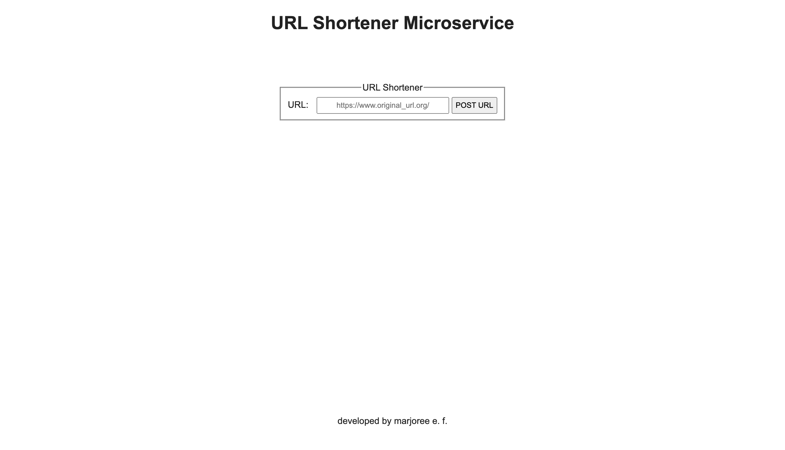

# URL Shortener Microservice

Challenge by freeCodeCamp intended to demonstrate backend knowledge on serving various types of data. Primarily developed using JavaScript.

## Table of contents

- [Overview](#overview)
  - [The challenge](#the-challenge)
  - [Screenshot](#screenshot)
  - [Links](#links)
- [My process](#my-process)
  - [Built with](#built-with)
  - [What I learned](#what-i-learned)
  <!-- - [Continued development](#continued-development)
  - [Useful resources](#useful-resources) -->
- [Author](#author)
- [Acknowledgments](#acknowledgments)

## Overview
Build a full stack JavaScript app that is functionally similar to this:  [Example](https://url-shortener-microservice.freecodecamp.rocks/). Working on this project will involve you writing your code using one of the following methods:

-Clone this GitHub repo and complete your project locally.
-Use our Replit starter project to complete your project.
-Use a site builder of your choice to complete the project. Be sure to incorporate all the files from our GitHub repo.

HINT: Do not forget to use a body parsing middleware to handle the POST requests. Also, you can use the function dns.lookup(host, cb) from the dns core module to verify a submitted URL.

### The challenge

Users should be able to:

- POST a URL to /api/shorturl and get a JSON response with original_url and short_url properties. Here's an example: { original_url : 'https://freeCodeCamp.org', short_url : 1}
- visit /api/shorturl/<short_url> and be redirected to the original URL.
- pass an invalid URL that doesn't follow the valid http://www.example.com format and the JSON response will contain { error: 'invalid url' }

### Screenshot


Result 1


### Links

- [Solution URL](https://github.com/mfargas/urlshortener.git)
- [Live Site URL](https://margie-urlshortener.herokuapp.com/)

## My process

### Built with

- Semantic HTML5 markup
- CSS custom properties
- JavaScript with a Backend Approach
- [Node.js](https://nodejs.org/en/) - JS Runtime
- [MongoDB Atlas](https://www.mongodb.com/) - Multi-cloud application data platform
- [Mongoose](https://mongoosejs.com/) - mongoDB Object Modeling for node.js
- [Express.js](http://expressjs.com/) - Node.js Framework


### What I learned

Configuration for using mongoose to access and modify mongoDB object models

```
var jsonParser = bodyParser.json();
const port = process.env.PORT || 4000;
mongoose.connect(process.env.URI);

let schema = new mongoose.Schema({ 
  original_url: String,
  short_url: String,
  trailing_id: String
});

let Url = mongoose.model('Url', schema);
```

<!-- ### Continued development
### Useful resources
- [Example resource 1](https://www.example.com) - 
- [Example resource 2](https://www.example.com) -  -->

## Author

- Website - [Marjoree E.F.](https://www.marjoree.com)
- Frontend Mentor - [@mfargas](https://www.frontendmentor.io/profile/mfargas)
- FreeCodeCamp - [@marjoreef](https://www.freecodecamp.org/marjoreef)
- Twitter - [@marjoree_js](https://www.twitter.com/yourusername)

## Acknowledgments
